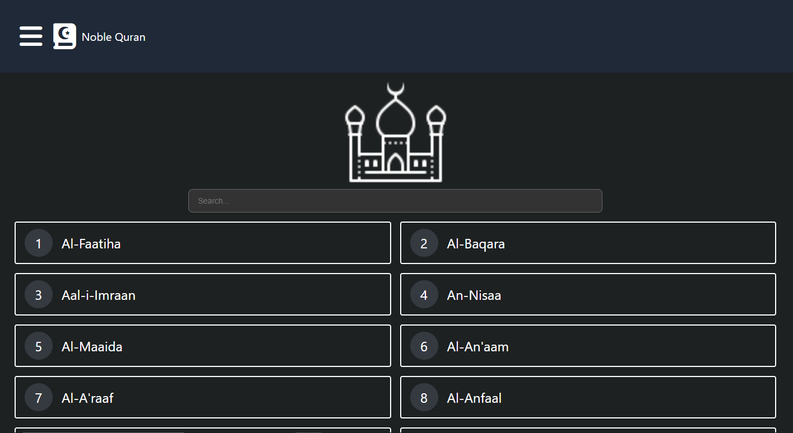
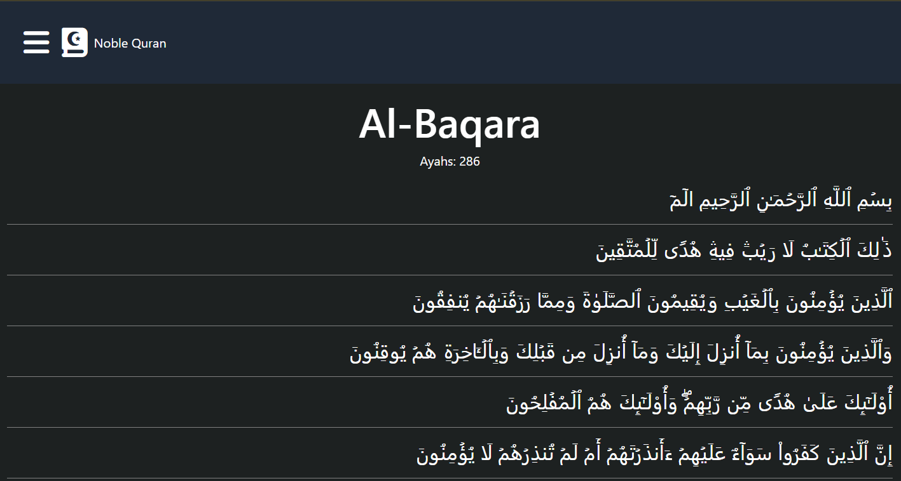

# quran-react-app
# 📖 Quran Application

A simple and complete Quran application that includes all 114 Surahs (chapters) of the Holy Quran. This app allows users to read and explore the Quran in a clean and user-friendly interface.

## 🌟 Features

- ✅ Displays all 114 Surahs with names and numbers
- 🔍 Search functionality to quickly find a Surah
- 📄 View full content of each Surah
- 🌙 Beautiful UI for a peaceful reading experience
- 📱 Responsive layout for mobile and desktop

## 🧰 Built With

- **React** (or specify framework you're using)
- **CSS / TailwindCSS / MUI** (based on your styling choice)
- **Surah Data** fetched from a static JSON file or API

=======
# Getting Started with Create React App

This project was bootstrapped with [Create React App](https://github.com/facebook/create-react-app).

## Available Scripts

In the project directory, you can run:

### `npm start`

Runs the app in the development mode.\
Open [http://localhost:3000](http://localhost:3000) to view it in your browser.

The page will reload when you make changes.\
You may also see any lint errors in the console.

### `npm test`

Launches the test runner in the interactive watch mode.\
See the section about [running tests](https://facebook.github.io/create-react-app/docs/running-tests) for more information.

### `npm run build`

Builds the app for production to the `build` folder.\
It correctly bundles React in production mode and optimizes the build for the best performance.

The build is minified and the filenames include the hashes.\
Your app is ready to be deployed!

See the section about [deployment](https://facebook.github.io/create-react-app/docs/deployment) for more information.

## 🖼️ Website Preview

